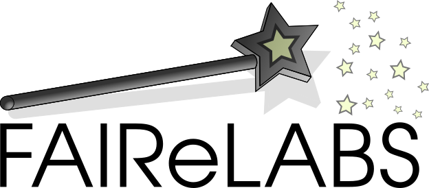

```{r setup, include=FALSE}
# global settings
knitr::opts_chunk$set(echo = FALSE)
# packages used for this presentation
pkgs <- c("knitr", "rmarkdown")
knitr::write_bib(pkgs, "packages.bib", prefix = "")
```

## Introduction {data-background="white" data-background-size=cover}

<iframe src="graphical_cv.html"></iframe>

# Digital Literacy

## Digital Literacy

**Why:**

 - Knowledge of the toolchain and "best practices" for better results
 - Data analysis and visualization under-appreciated

**What I have done so far:**

 - Work with several programming languages, code designs, and DevOps concepts
 - Organizer UU code club, off/online courses in data analysis with R

**What I like to do in the future:**

- More effectively communicate results of geochemical models
- Integration of model output with other aspects of the BAM project
- An analysis of the effectiveness of digital tools
- Make results accessible for a large audience

<div class="notes">
  Data analysis can be stimulated by giving the right tools to the students: open source data analysis platforms.
</div>

# Educational tools

## Oceanexplorer

Sampling the ocean with the NOAA Oceanexplorer

<iframe src="https://utrecht-university.shinyapps.io/oceanexplorer/"></iframe>


# Data Management

## What is iRODS

- **Distributed**
  + Runs on a laptop, a cluster, on premises or geographically distributed

- **Open Source** 
  + BSD-3 Licensed, install it today and try before you buy
  
- **Data Centric & Metadata Driven**
  + Insulate both your user and your data from your infrastructure
  
## Taking Command of Lab-data

Opening-up the black box of lab-data (Cameca, Zeiss, Thermo Fisher)    

- Prevent tracking data from source to publication
- Fragmented storage 
- Monitoring and troubleshooting is reduced to current analysis

<center>
{width=60%}
</center>

## Step One: Getting the Lab-data

Parsing unstructured text data.

<center>
{width=100%}
</center>

<div class="notes">
  I think this important for the advertised project as oceanographic (sensor) data will be central to the project. So data management will be central to successful project execution. 
</div>

## Making Data Management Easy

<center>
{width=30%}
</center>
<br>

One of the biggest problems in research is the inadvertent destruction of data and the inaccessibility of data due to poor labeling and description of data [@Briney2015]. 

**Solutions:**

- Pure R client for iRODS (official launch June this year)
- Opinionated and interactive tools for data annotation and versioning
- Workflows and processing pipelines with integrated data management


<div class="notes">
  Data management for Researchers: Kristin Briney
  Separating the data (iRODS server) from the analysis (local or HPC).
</div>

## Data literacy

All these solutions would benefit from integral workshops and courses that teach the importance of good data management.

## Thanks {data-background="white" data-background-size=cover}

<iframe src="graphical_cv.html"></iframe>

## References
